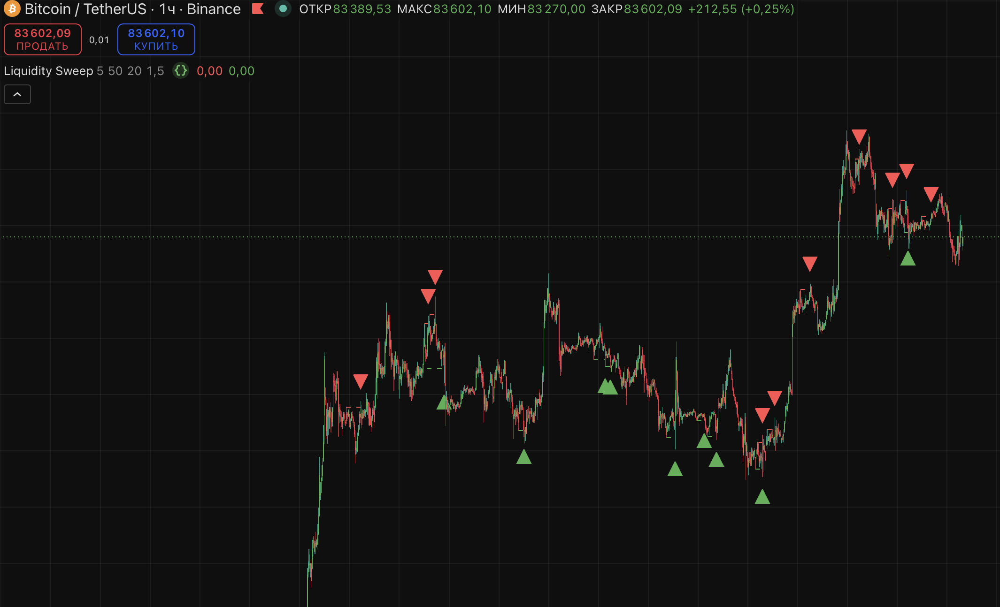

# pine-indicators

TradingView indicators I made (Pine Script v5)

## Liquidity Sweep Pro

Marks stop hunts - when price wicks through a level and closes back inside.

Watches the last swing high/low and the previous day high/low (PDH/PDL). Red triangle = high swept, green = low swept.

Small table in the corner shows how many sweeps were on the chart and how often price reversed by X% within N bars after. Good way to check if it works on a coin before trading it.

Best on 15m - 4h. Has alerts. I don't trade it alone, only with market structure.
